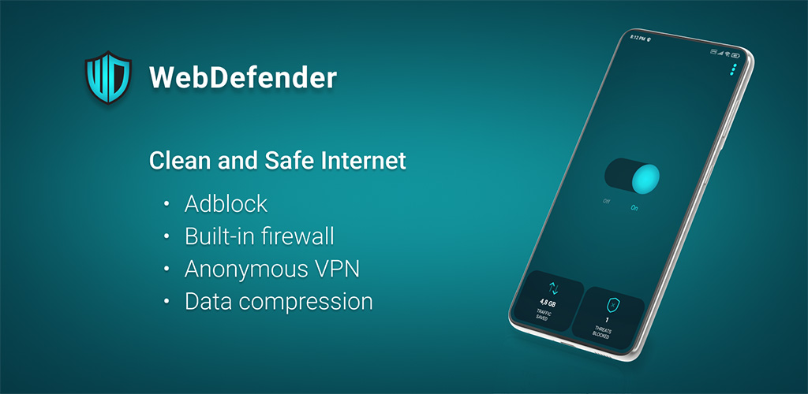

# WebDefender
The Effective Ad Blocker and The Ultimate Firewall for Android Devices
 

  

Are you tired of those annoying ads and pop-ups? Or are you sick of being tracked by third-parties and restricted out from your favorite site? Well, here’s what you need. With WebDefender Adblock & Firewall you can shut them all off at once.
 
 
Currently available on the Samsung Galaxy Store: <a href="https://galaxystore.samsung.com/detail/app.webdefender.samsung" target="_blank">https://galaxystore.samsung.com/detail/app.webdefender.samsung</a>
 
 
Homepage: <a href="https://webdefender.app" target="_blank">https://webdefender.app</a>

## Before build

+ Create a keystore named WebDefender.keystore and a keystore.properties file with storePassword, keyAlias, and keyPassword in the root directory of the project.
+ Use Gradle version 8.5

## License

Copyright 2013-2025 Roman Popov

Licensed under the GNU GPLv3: https://www.gnu.org/licenses/gpl-3.0.html
